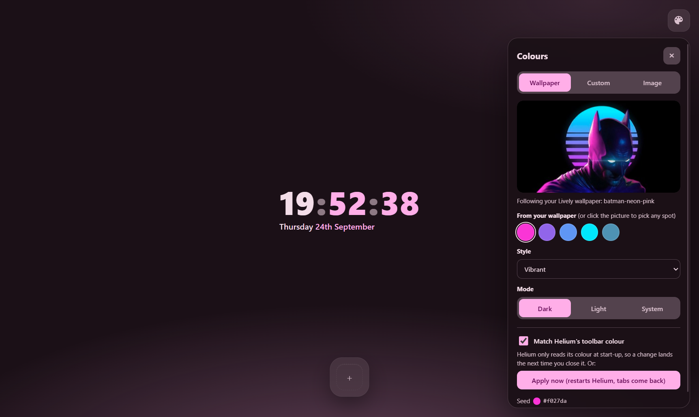
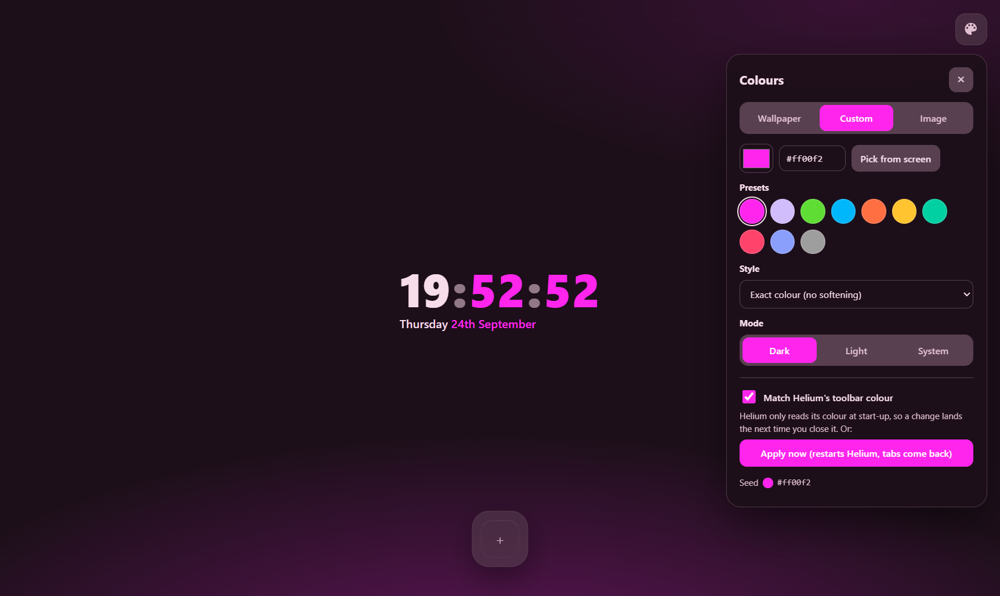
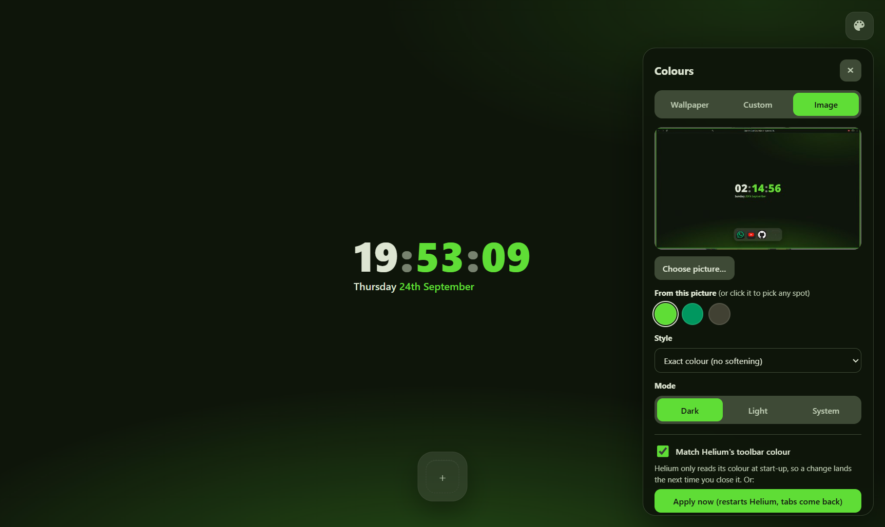
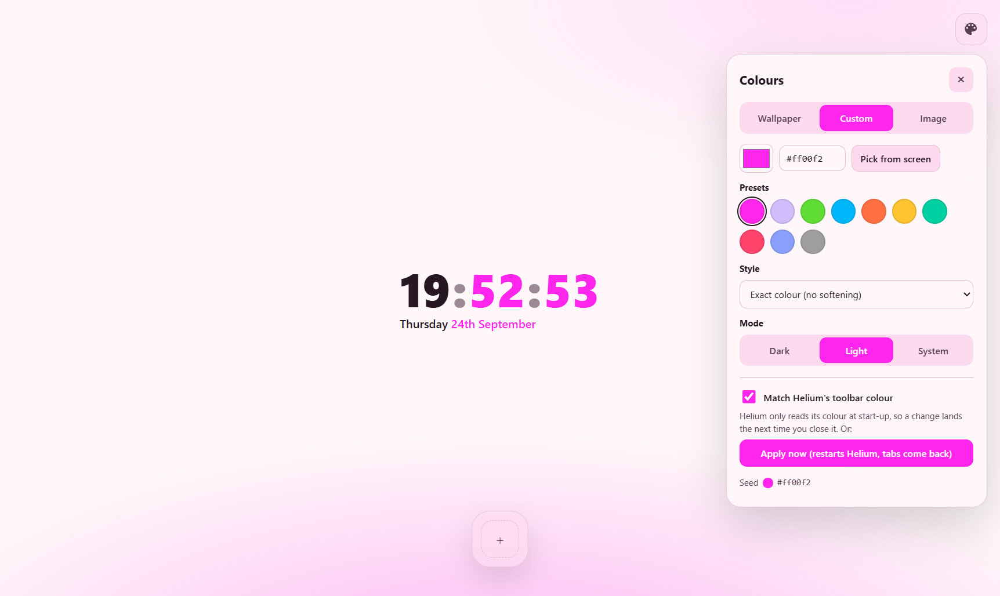

# Quiet Tab for Windows

The Windows version of [Quiet Tab](https://github.com/SammyNashed/quiet-tab): a minimal, curated New Tab page for
[Helium](https://helium.computer) (or any Chromium browser). On Linux it followed matugen. Windows has no matugen, so this
port comes with its own:

- **Follows your wallpaper, live**, including animated [Lively Wallpaper](https://www.rocksdanister.com/lively/) ones
  as well as the ordinary Windows desktop picture. Change the wallpaper and every open New Tab recolours within a couple
  of seconds.
- **Built-in colour picker.** Choose any of the colours pulled from the wallpaper, or click anywhere on the wallpaper
  preview to use that exact spot. You can also pick a custom colour (colour wheel, hex, presets, or *Pick from screen*,
  which samples anything on your screen), or upload any picture.
- **Same colour science as matugen**: Google's
  [material-color-utilities](https://github.com/material-foundation/material-color-utilities), with every Material
  You style (Tonal spot, Vibrant, Expressive, Fidelity, …) plus *Exact colour* for when you want your colour unsoftened.
  It also has dark, light, or follow-the-system modes.
- **Matching Helium's toolbar is up to you.** Unlike the Linux version, nothing here touches Helium's settings or
  restarts it. To match, open ⋮ → Customize in Helium and pick one of its colours.

  
  
  
  

## Install

1. Download or clone this repo somewhere permanent (for example `C:\Users\you\quiet-tab-windows`).
2. Double-click **`Install.bat`**. It builds the little helper with the C# compiler that already ships with Windows
   (no downloads, no prebuilt binaries) and registers it with Helium, Chrome, Chromium and Brave. It only
   reads the wallpaper and never writes to the browser.
3. In Helium open `helium://extensions`, switch on **Developer mode**, click **Load unpacked**, and choose the
   **`extension`** folder.
4. Open a new tab and click the palette button in the top-right corner.

Without step 2 everything still works except following the wallpaper; the page tells you so. `Uninstall.bat` unregisters the helper.

## How it works

| Piece | What it does |
|---|---|
| `extension/` | The New Tab page, plus a background worker that turns the colour source into a palette. |
| `extension/palette.js` | Wallpaper → seed colours (Celebi quantizer + Score, as in matugen) → Material You scheme. |
| `helper/QuietTabHelper.cs` | A [native messaging](https://developer.chrome.com/docs/extensions/develop/concepts/native-messaging) host. Helium starts it on demand. It finds the current wallpaper (Lively's active wallpaper, falling back to the Windows desktop picture or solid colour) and sends a small thumbnail whenever it changes. |

Differences from the Linux version:

- No matugen, `colors.json` or GTK pieces. The extension computes the palette itself and keeps it in extension storage.
- Helium's toolbar colour isn't synced. On Linux a matugen hook rewrote Helium's Preferences and restarted it. Windows
  Helium only reads that colour at start-up and won't let an extension quit it, so syncing meant a restart every time.
  Pick one of Helium's colours in its Customize panel instead.

## Notes

- The extension's ID is fixed (`joacmdfomnhaeiljfnfjjadkjjbbkhcp`) through the `key` in `manifest.json`. The helper only
  answers that ID.
- Shortcuts, icon caching and the curated icons in `extension/icons/apps/` are carried over from the Linux version,
  with the same caveat: those two override images come from third-party icon packs.
- The helper logs to `%LOCALAPPDATA%\QuietTab\helper.log`.

## License

MIT, see [LICENSE](LICENSE). `extension/vendor/mcu.js` is material-color-utilities, © Google, Apache 2.0
(`extension/vendor/mcu.LICENSE`).
