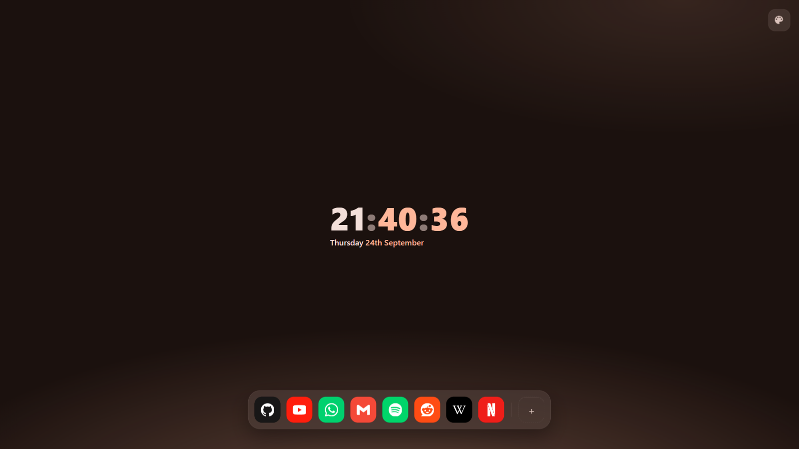
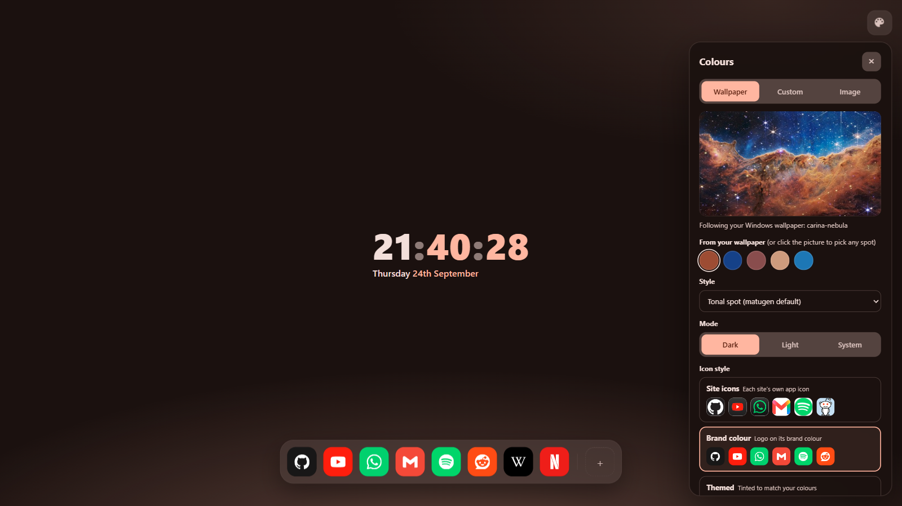
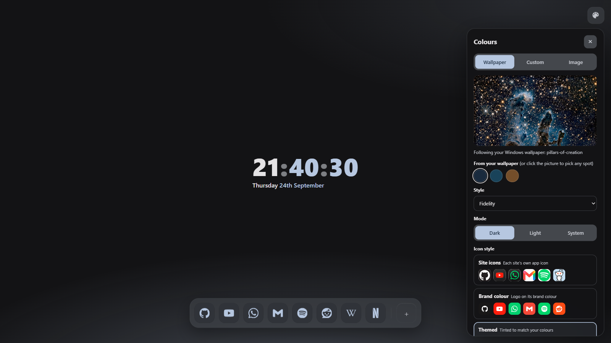
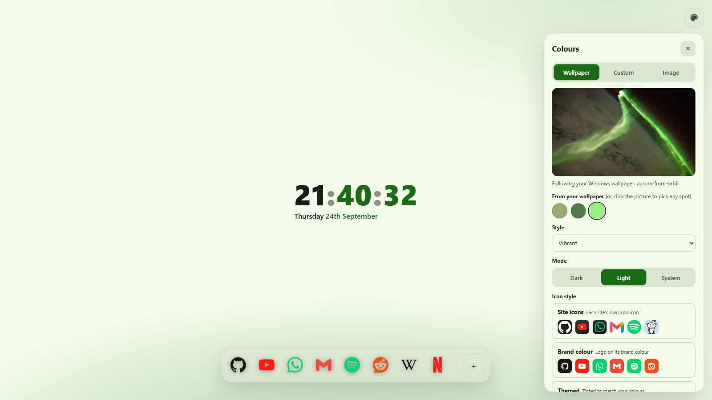
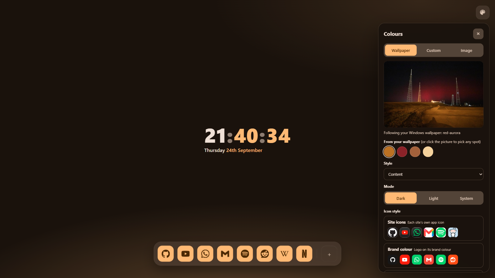
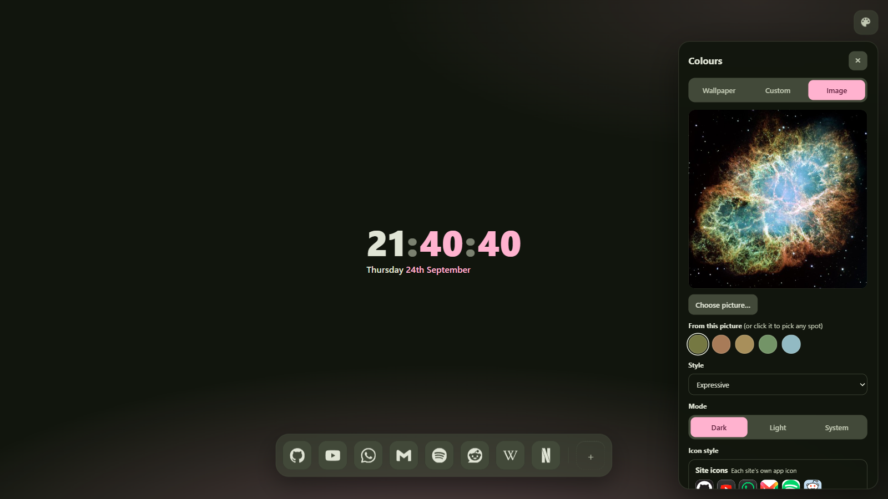
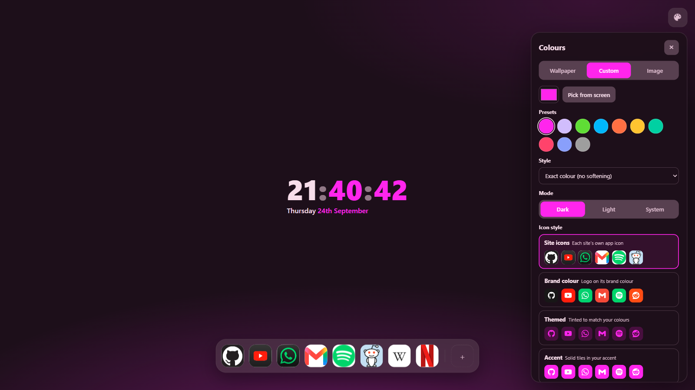
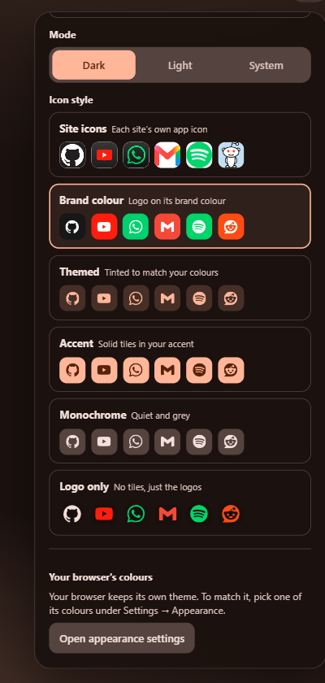
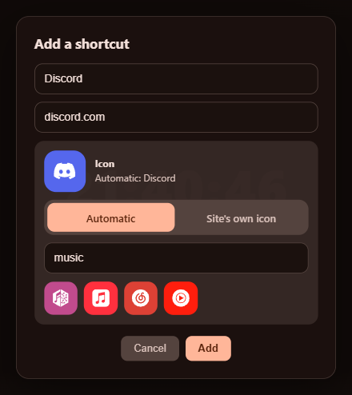

# Quiet Tab for Windows

A minimal, curated New Tab page that **takes its colours from your desktop wallpaper**. It works in any Chromium browser
on Windows: Chrome, Edge, Brave, Helium, Vivaldi and others. It's the Windows version of
[Quiet Tab](https://github.com/SammyNashed/quiet-tab), which does the same on Linux with matugen.

- **Follows your wallpaper, live.** It picks up animated [Lively Wallpaper](https://www.rocksdanister.com/lively/) ones
  and the ordinary Windows desktop picture. Change the wallpaper and every open New Tab recolours within a couple
  of seconds.
- **Built-in colour picker.** Choose any of the colours pulled from the wallpaper, or click anywhere on the wallpaper
  preview to use that exact spot. You can also pick your own colour (colour wheel, presets, or *Pick from screen*,
  which samples anything on your screen), or upload any picture.
- **Nine Material You styles**, using the same colour engine as matugen: Tonal spot, Vibrant, Expressive, Fidelity,
  Content, Rainbow, Fruit salad, Neutral and Monochrome. There's also *Exact colour* for when you want your colour
  unsoftened, and dark, light or follow-the-system modes.
- **Your own shortcuts, with 3,400+ bundled icons in six styles.** Pick how the whole dock looks: *Site icons*,
  *Brand colour*, *Themed* (tinted to your wallpaper), *Accent*, *Monochrome* or *Logo only*. Each style shows a live
  preview of your own shortcuts. Icons are matched to each shortcut automatically, or you can search the library and
  choose one yourself. No tracking and no "most visited".

| | |
|---|---|
|  |  |
| Carina Nebula · *Tonal spot* · Brand colour icons | Pillars of Creation · *Fidelity* · Themed icons |
|  |  |
| Aurora from orbit, second swatch picked · *Vibrant*, light · Logo only | Red aurora · *Content* · Accent icons |
|  |  |
| An uploaded picture (Crab Nebula) · *Expressive* · Monochrome icons | Custom colour · *Exact colour* · Site icons |

## Shortcut icons

  
  

- The extension ships with the whole [Simple Icons](https://simpleicons.org) set: 3,400+ brand logos, each with its
  official colour.
- Pick a style under **Icon style** in the colour panel; every option previews your own shortcuts.
- Adding a shortcut (**+**) or editing one (the **✎** that appears on hover) shows its icon straight away. You can keep
  *Automatic* (matched from the address, for example `mail.google.com` → Gmail and `drive.google.com` → Google Drive),
  use *Site's own icon*, or search the library and pick any logo.
- A few big brands don't allow their logos in Simple Icons (Microsoft, Amazon, LinkedIn, OpenAI, Slack). Those use the
  site's own icon in *Brand colour*, and a lettered tile in the other styles, unless you pick something else.

## Install

1. **Get the files.** Download `QuietTab-Windows-<version>.zip` from the
   [latest release](https://github.com/SammyNashed/quiet-tab-windows/releases/latest) and unzip it somewhere it can
   stay, such as `Documents\quiet-tab-windows`. Don't delete the folder afterwards; the browser loads the extension
   from it.
2. **Double-click `Install.bat`** (optional, but it's what makes the wallpaper following work). It builds a small
   helper with the C# compiler that already ships with Windows, so there's nothing to download and no prebuilt exe.
   It also registers the helper with Chrome, Edge, Brave, Helium, Vivaldi and Chromium. The helper only reads the
   wallpaper and never changes anything in your browser.
3. **Load the extension.** Open your browser's extensions page (`chrome://extensions`, `edge://extensions`,
   `brave://extensions`, …), turn on **Developer mode**, click **Load unpacked**, and choose the **`extension`**
   folder *inside* the one you unzipped. Choosing the outer folder gives "Manifest file is missing".
4. **Open a new tab.** If the browser asks whether to keep the changed New Tab page, choose to keep it. Then click
   the palette button in the top-right corner.

Skipping step 2 still gives you everything except following the wallpaper; the page says so. `Uninstall.bat` removes the
helper again.

**Matching the browser itself:** the extension doesn't change your browser's own theme. The panel has an *Open
appearance settings* button, where you can pick one of the browser's colours to go with it.

## Sharing it with friends

Send them the link to the release page:

> https://github.com/SammyNashed/quiet-tab-windows/releases/latest

They follow the four install steps above. Things worth telling them:

- It's Windows-only because of the wallpaper helper. The New Tab page itself would run in Chrome on any OS, just
  without wallpaper following.
- Loading it unpacked means their browser may show a "developer mode extensions" notice now and then. That's normal
  for anything installed outside the Chrome Web Store.
- To update, they download the new zip, replace the folder, and press the reload arrow on the extension card.

## How it works

| Piece | What it does |
|---|---|
| `extension/` | The New Tab page, plus a background worker that turns the colour source into a palette. |
| `extension/icons.js` + `extension/icons/library.json` | The icon library (built from Simple Icons by `tools/build-icon-library.mjs`), domain matching, and the six icon styles. The 4.7 MB library is only read when adding or matching a shortcut; each shortcut keeps its own icon, so a new tab never loads it. |
| `extension/palette.js` | Wallpaper → seed colours (Celebi quantizer + Score, as in matugen; near-black and near-grey swatches are dropped) → Material You scheme. |
| `helper/QuietTabHelper.cs` | A [native messaging](https://developer.chrome.com/docs/extensions/develop/concepts/native-messaging) host that the browser starts on demand. It finds the current wallpaper (Lively's active wallpaper, falling back to the Windows desktop picture or solid colour) and sends a small thumbnail whenever it changes. |

The extension's ID is fixed (`joacmdfomnhaeiljfnfjjadkjjbbkhcp`) by the `key` in `manifest.json`, so it's the same in
every browser and on every PC, and the helper only answers that ID. It has been tested in Chrome 154, Edge and
Helium 0.18.

## Credits

- Colour science: Google's [material-color-utilities](https://github.com/material-foundation/material-color-utilities)
  (Apache 2.0), bundled as `extension/vendor/mcu.js`.
- Screenshot wallpapers: public-domain images from the [NASA Image and Video Library](https://images.nasa.gov)
  (`carina_nebula`, `GSFC_20171208_Archive_e000842`, `iss023e058455`, `KSC-20251111-PH-JBS01_0011`, `PIA03606`).
- Shortcut icons: [Simple Icons](https://github.com/simple-icons/simple-icons) (CC0), bundled as
  `extension/icons/library.json`. The logos are trademarks of their owners and are shown only to identify each site.
- The two curated *Site icons* in `extension/icons/apps/` come from third-party icon packs, as in the Linux version.

## License

MIT, see [LICENSE](LICENSE).
