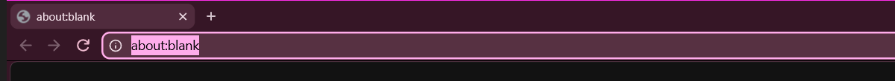

# Quiet Tab for Windows

The Windows version of [Quiet Tab](https://github.com/SammyNashed/quiet-tab): a minimal, curated New Tab page for
[Helium](https://helium.computer) (or any Chromium browser). On Linux it followed matugen. Windows has no matugen, so this
port comes with its own:

- **Follows your wallpaper, live**, including animated [Lively Wallpaper](https://www.rocksdanister.com/lively/) ones
  as well as the ordinary Windows desktop picture. Change the wallpaper and every open New Tab recolours within a couple
  of seconds.
- **Built-in colour picker.** Choose any of the colours pulled from the wallpaper, or click anywhere on the wallpaper
  preview to use that exact spot. You can also pick a custom colour (colour wheel, hex, presets, or *Pick from screen*,
  which samples anything on your screen), or upload any picture.
- **Same colour science as matugen**: Google's
  [material-color-utilities](https://github.com/material-foundation/material-color-utilities), with every Material
  You style (Tonal spot, Vibrant, Expressive, Fidelity, …) plus *Exact colour* for when you want your colour unsoftened.
  It also has dark, light, or follow-the-system modes.
- **Helium's own toolbar follows too**, like on Linux: the change lands the next time you close Helium. You can also
  press *Apply now* and quit Helium once; it reopens in the new colour with all your tabs.

  
  
  
  

## Install

1. Download or clone this repo somewhere permanent (for example `C:\Users\you\quiet-tab-windows`).
2. Double-click **`Install.bat`**. It builds the little helper with the C# compiler that already ships with Windows
   (no downloads, no prebuilt binaries) and registers it with Helium, Chrome, Chromium and Brave.
3. In Helium open `helium://extensions`, switch on **Developer mode**, click **Load unpacked**, and choose the
   **`extension`** folder.
4. Open a new tab and click the palette button in the top-right corner.

Without step 2 everything still works except reading the wallpaper and recolouring Helium's toolbar; the page tells you
so. `Uninstall.bat` unregisters the helper.

## How it works

| Piece | What it does |
|---|---|
| `extension/` | The New Tab page, plus a background worker that turns the colour source into a palette. |
| `extension/palette.js` | Wallpaper → seed colours (Celebi quantizer + Score, as in matugen) → Material You scheme. |
| `helper/QuietTabHelper.cs` | A [native messaging](https://developer.chrome.com/docs/extensions/develop/concepts/native-messaging) host. Helium starts it on demand. It finds the current wallpaper (Lively's active wallpaper, falling back to the Windows desktop picture or solid colour) and sends a small thumbnail whenever it changes. |
| `--apply-accent` | Helium only reads its toolbar colour at start-up and rewrites its Preferences on exit, so the helper waits in the background until Helium has fully closed. Then it writes `browser.theme.user_color2` and relaunches Helium only if you pressed *Apply now*. Before each write it saves a backup to `Preferences.quiettab.bak`. |

Differences from the Linux version:

- No matugen, `colors.json` or GTK pieces. The extension computes the palette itself and keeps it in extension storage.
- Helium on Windows uses Chromium's variant numbers (1 tonal spot, 2 neutral, 3 vibrant, 4 expressive). Variant 2 turns
  the toolbar grey there, so the toolbar variant follows the style you pick, defaulting to 3.
- Helium doesn't let an extension quit the browser (`chrome://quit` is blocked), and closing its windows one by one
  would lose all but the last window's tabs. *Apply now* therefore asks you to quit Helium from its menu once.

If you'd rather have Helium's toolbar follow your **Windows accent colour**, Helium's own *Customize → Follow device
colors* does that. In that case turn off *Match Helium's toolbar colour* here.

## Notes

- The extension's ID is fixed (`joacmdfomnhaeiljfnfjjadkjjbbkhcp`) through the `key` in `manifest.json`. The helper only
  answers that ID.
- Shortcuts, icon caching and the curated icons in `extension/icons/apps/` are carried over from the Linux version,
  with the same caveat: those two override images come from third-party icon packs.
- The helper logs to `%LOCALAPPDATA%\QuietTab\helper.log`.

## License

MIT, see [LICENSE](LICENSE). `extension/vendor/mcu.js` is material-color-utilities, © Google, Apache 2.0
(`extension/vendor/mcu.LICENSE`).
